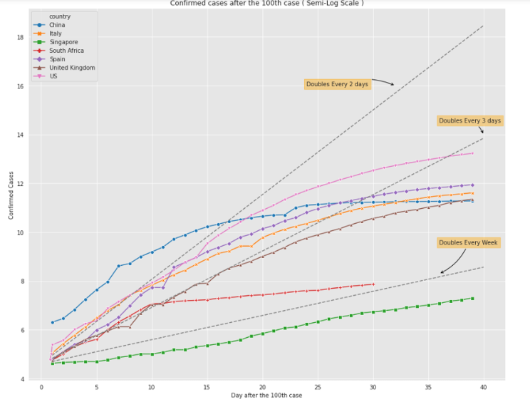
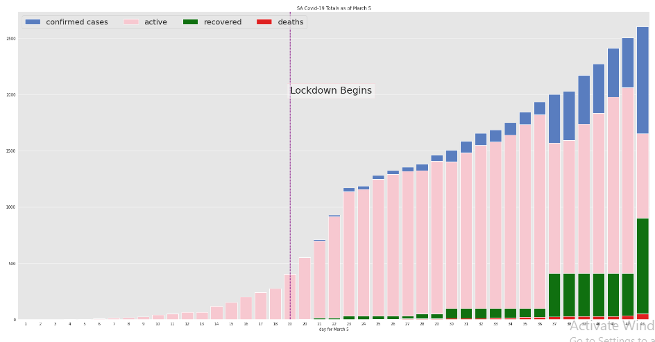
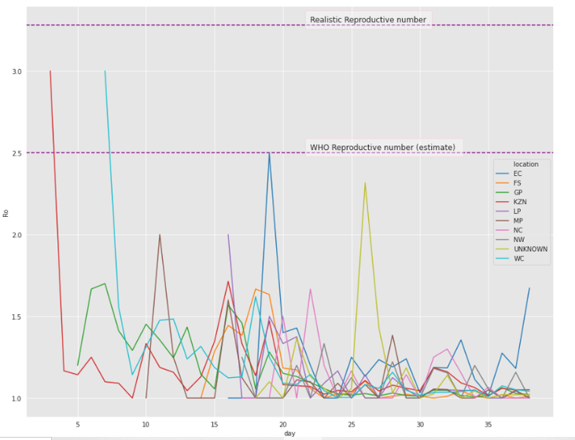

### This Notebook aims to use Exploratory Data Analyses (EDA) to provide insights and actionable conclusions towards the following topics :- 

 - SA vs 'The World'
 - Effectiveness of the Response ( A Broader look at stats ? )
 - Easing the lockdown ( Is it really justified ? )
 - Are we conducting enough tests?

Using the database created by EXPLORE DATA SCIENCE ACADEMY

### Highlights

